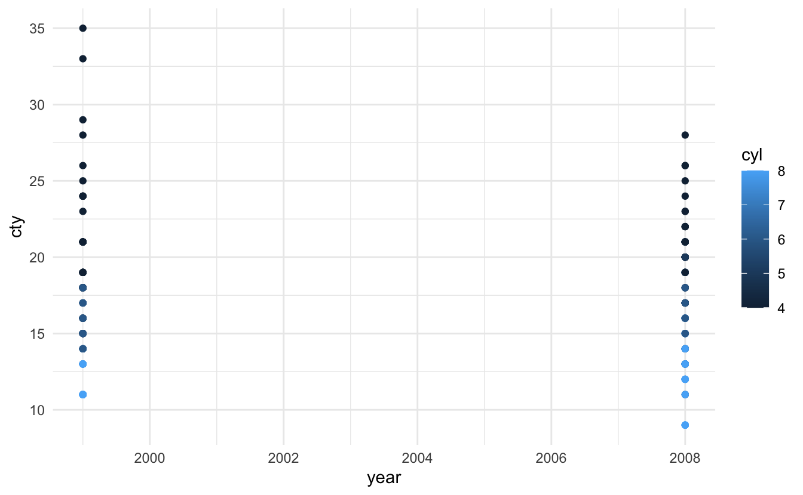

This is only a test

<!--more-->

This is a plot I made to see if the output gets saved in the same folder as the post's `.Rmarkdown` file and gets included correctly:

<pre class='chroma'><code class='language-r' data-lang='r'><a href='https://rdrr.io/r/base/library.html'>library</a>(<a href='http://ggplot2.tidyverse.org'>ggplot2</a>)

<a href='https://ggplot2.tidyverse.org/reference/ggplot.html'>ggplot</a>(mpg, <a href='https://ggplot2.tidyverse.org/reference/aes.html'>aes</a>(x = year, y = cty, color = cyl)) +
  <a href='https://ggplot2.tidyverse.org/reference/geom_point.html'>geom_point</a>() +
  <a href='https://ggplot2.tidyverse.org/reference/ggtheme.html'>theme_minimal</a>()

</code></pre>

